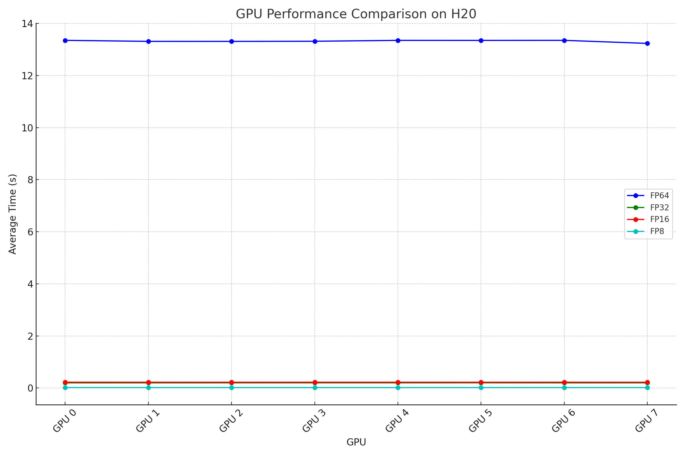

# GPU Performance Testing for Sound Algorithms

This repository contains a GPU performance testing script using CUDA to evaluate the execution time of various sound algorithms including matrix multiplication, octave kernel, and mel spectrogram generation. The script runs these algorithms across different GPU architectures and logs the performance metrics.

## Prerequisites

- CUDA Toolkit
- NVIDIA Management Library (NVML)
- cuBLAS Library
- cuFFT Library
- C++11 or later

## Compilation

To compile the code, use the following command:

```bash
nvcc -o gpu_performance_test main.cpp -lcublas -lcufft -lnvml
```

## Usage

Run the compiled binary with the optional argument --iter to specify the number of test iterations:

```bash
./gpu_performance_test --iter <iterations>
```

By default, the script runs 10 iterations if the --iter option is not provided.

## Features
- **Matrix Multiplication:** Tests matrix multiplication for various precisions (FP64, FP32, FP16, FP8).
- **Octave Kernel:** Tests the octave kernel for various precisions.
- **Mel Spectrogram Generation:** Tests mel spectrogram generation for various precisions.

## Metrics Logged
For each GPU, the following metrics are logged:

- Average execution time
- Maximum execution time
- Minimum execution time
- Number of iterations
- Kernel name
- GPU temperature
- GPU utilization
- GPU memory used
- Total GPU memory

## Example Output

```bash
Starting GPU Performance Test with 4 GPUs.
GPU 0 Func matmul_fp64: Exec Time = 0.123s, Iterations = 1
GPU 0 Func matmul_fp32: Exec Time = 0.045s, Iterations = 1
...
GPU 0 Summary: matmul_fp64 Avg Time = 0.123s, Min Time = 0.123s, Max Time = 0.123s, Iterations = 1, Temperature = 60C, GPU Utilization = 80%, Memory Used = 500 MB, Total Memory = 8000 MB
...
GPU performance testing completed.
```

## Test Results
### CUDA and Library Versions
- CUDA Runtime Version: 12040
- Driver Version: 12040
- cuBLAS Version: 120402
- cuFFT Version: 11200
### GPU Performance Summary on H20
The performance summary of different precisions (FP64, FP32, FP16, FP8) across various GPUs is provided below:

| GPU    | FP64 (s) | FP32 (s) | FP16 (s) | FP8 (s) |
|--------|----------|----------|----------|---------|
| GPU 0  | 13.353   | 0.196    | 0.220    | 0.018   |
| GPU 1  | 13.314   | 0.196    | 0.219    | 0.018   |
| GPU 2  | 13.313   | 0.197    | 0.218    | 0.018   |
| GPU 3  | 13.318   | 0.197    | 0.219    | 0.018   |
| GPU 4  | 13.352   | 0.197    | 0.219    | 0.018   |
| GPU 5  | 13.351   | 0.198    | 0.218    | 0.018   |
| GPU 6  | 13.353   | 0.196    | 0.219    | 0.018   |
| GPU 7  | 13.236   | 0.196    | 0.218    | 0.018   |

### Comparison Plot


## Contribution
Feel free to fork this repository, submit issues, and make pull requests. For major changes, please open an issue first to discuss what you would like to change.


## License
This project is licensed under the Apache-2.0 license - see the [LICENSE](LICENSE) for details.